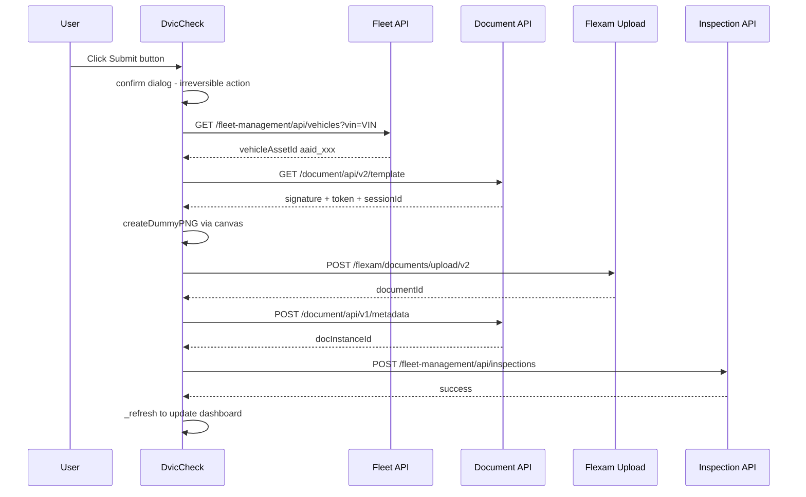

# Post-Trip DVIC Auto-Submit — Architecture Design

## 1. Architecture Overview

This feature adds **post-trip DVIC submission** capabilities directly into the existing [`DvicCheck`](cortex-tools/src/features/dvic-check.ts:35) class. The user can submit post-trip DVICs for vehicles that have pre-trip inspections but are missing post-trip inspections — either individually per row or in bulk.

### Integration Strategy

- **No new feature class.** All logic lives inside [`DvicCheck`](cortex-tools/src/features/dvic-check.ts:35)
- The class already owns the vehicle data ([`_vehicles`](cortex-tools/src/features/dvic-check.ts:38)), overlay UI ([`_overlayEl`](cortex-tools/src/features/dvic-check.ts:36)), and refresh mechanism ([`_refresh()`](cortex-tools/src/features/dvic-check.ts:430))
- New private methods handle the 4-step API pipeline
- A new feature flag [`dvicAutoSubmit`](cortex-tools/src/core/storage.ts:3) gates the submit UI
- A new GM menu command provides a shortcut to open the Missing tab directly

### Submission Pipeline



---

## 2. New Interfaces & Types

All types are added to [`cortex-tools/src/features/dvic-check.ts`](cortex-tools/src/features/dvic-check.ts:1) at the top of the file, alongside the existing [`VehicleRecord`](cortex-tools/src/features/dvic-check.ts:15) and [`VsaRecord`](cortex-tools/src/features/dvic-check.ts:27) interfaces.

```typescript
/** Credentials returned by Step 1: GET /document/api/v2/template */
interface UploadTemplate {
  axSignature: string;
  axSessionId: string;
  axDocDisposition: string;
  fileFieldName: string;   // e.g. 'KAAGZAAT_PLATFORM-file-1'
  uploadAction: string;    // e.g. '/flexam/documents/upload/v2'
  token: string;           // already URL-encoded once
}

/** Params for Step 4: POST /fleet-management/api/inspections */
interface InspectionPayload {
  inspectionStartTime: number;   // Date.now()
  inspectionType: 'POST_TRIP_DVIC';
  VIN: string;
  defectsFound: [];
  paperInspectionDocId: string;  // docInstanceId from Step 3
  reporterId: string;
  serviceAreaId: string;
}

/** Result for a single vehicle submission attempt */
interface SubmitResult {
  vin: string;
  success: boolean;
  error?: string;
  failedStep?: number;  // 0=assetId, 1=template, 2=upload, 3=metadata, 4=inspection
}
```

---

## 3. New Class Members on DvicCheck

### New Private Properties

```typescript
// Asset ID cache: VIN → vehicleAssetId (aaid_xxx)
private _assetIdCache = new Map<string, string>();

// Track submission state per VIN for UI updates
private _submitStates = new Map<string, 'idle' | 'loading' | 'success' | 'error'>();
```

### Method Signatures & Descriptions

#### Vehicle Asset ID Resolution

```typescript
/**
 * Resolves a VIN to its vehicleAssetId (format: aaid_XXXXXXXX-...).
 * Results are cached in _assetIdCache.
 *
 * API: GET https://logistics.amazon.de/fleet-management/api/vehicles?vin={vin}
 * Expected response: { data: [{ vehicleAssetId: 'aaid_...' }] } or similar
 */
private async _resolveVehicleAssetId(vin: string): Promise<string>
```

#### Dummy PNG Generation

```typescript
/**
 * Creates a minimal 1x1 transparent PNG via a canvas element.
 * Returns a File object named 'inspection-report.png'.
 * Entirely client-side — no external dependencies.
 */
private _createDummyPNG(): Promise<File>
```

#### Step 1: Get Upload Template

```typescript
/**
 * Step 1: GET /document/api/v2/template
 * Query params: docClass=PaperInspectionReport, numFiles=1, numCSVFiles=0, clientAppId=FleetMgmt
 * Returns: UploadTemplate with signature, sessionId, token, etc.
 */
private async _getUploadTemplate(): Promise<UploadTemplate>
```

#### Step 2: Upload Dummy File

```typescript
/**
 * Step 2: POST /flexam/documents/upload/v2
 * Uploads the dummy PNG using multipart/form-data with credentials from template.
 * Response has 'while(1);' prefix that must be stripped before JSON parse.
 * Returns: documentId (e.g. 'urn:alx:doc:...')
 */
private async _uploadDummyFile(template: UploadTemplate, file: File): Promise<string>
```

#### Step 3: Set Document Metadata

```typescript
/**
 * Step 3: POST /document/api/v1/metadata
 * Associates the uploaded document with the vehicle via vehicleAssetId.
 * Token must be double-encoded in the query string.
 * Returns: docInstanceId (UUID)
 */
private async _setDocumentMetadata(
  vehicleAssetId: string,
  documentId: string,
  token: string,
): Promise<string>
```

#### Step 4: Submit Inspection

```typescript
/**
 * Step 4: POST /fleet-management/api/inspections
 * Final API call that creates the post-trip DVIC inspection record.
 * Returns: the API response body
 */
private async _submitInspection(payload: InspectionPayload): Promise<unknown>
```

#### Orchestrator Method

```typescript
/**
 * Orchestrates the full 4-step pipeline for a single vehicle.
 * Resolves vehicleAssetId, then runs Steps 1-4 sequentially.
 * Updates _submitStates and re-renders the row button.
 *
 * Reporter ID is taken from vehicle.reporterIds[0].
 * If no reporterId exists, prompts the user via window.prompt.
 *
 * @throws with context about which step failed
 */
private async _submitPostTripDvic(vehicle: VehicleRecord): Promise<SubmitResult>
```

#### Single Submit Handler

```typescript
/**
 * Called by the per-row Submit button click.
 * Shows a confirm() dialog, then calls _submitPostTripDvic.
 * Updates button state: loading → success/error.
 */
private async _handleSingleSubmit(vehicle: VehicleRecord): Promise<void>
```

#### Bulk Submit Handler

```typescript
/**
 * Called by the Submit All Missing button.
 * Shows a confirm() dialog listing the count of vehicles.
 * Iterates all missing vehicles sequentially.
 * Continues on individual failure, collects SubmitResult[].
 * Shows a summary alert at the end.
 * Triggers _refresh() to update the dashboard.
 */
private async _handleBulkSubmit(): Promise<void>
```

#### Reporter ID Prompt

```typescript
/**
 * Shows a prompt dialog asking the user to enter a reporter ID manually.
 * Used as fallback when vehicle.reporterIds is empty.
 * Returns: the entered ID, or null if cancelled
 */
private _promptForReporterId(vin: string): string | null
```

---

## 4. UI Mockups

### Missing Tab — Before Submit

```
┌──────────────────────────────────────────────────────────────────────┐
│  🚛 DVIC Check                                            ✕ Schließen │
│  Stand: 25.03.2026 15:12:05                                          │
├──────────────────────────────────────────────────────────────────────┤
│  ┌──────┐ ┌──────┐ ┌──────┐ ┌──────┐                                │
│  │  12  │ │   3  │ │   5  │ │   9  │                                │
│  │Gesamt│ │Fehler│ │Fehl. │ │  OK  │                                │
│  └──────┘ └──────┘ └──────┘ └──────┘                                │
├──────────────────────────────────────────────────────────────────────┤
│ [Alle Fahrzeuge] [⚠️ DVIC Fehlend (3)] [🔍 VSA]                     │
├──────────────────────────────────────────────────────────────────────┤
│  [👤 Transporter einblenden]  [🔄 Alle fehlenden absenden]           │
│                                                                      │
│  Fahrzeug         │ Pre ✓ │ Post ✓ │ Fehlend │ Aktion               │
│  ─────────────────┼───────┼────────┼─────────┼──────────────────     │
│  WV1ZZZ7HZPH04639 │   1   │   0    │    1    │ [▶ Absenden]         │
│  WV1ZZZSY1R900553 │   2   │   0    │    2    │ [▶ Absenden]         │
│  WV1ZZZ7HZPH04641 │   1   │   0    │    1    │ [▶ Absenden]         │
│                                                                      │
│  Seite 1 / 1 (3 Einträge)                                           │
└──────────────────────────────────────────────────────────────────────┘
```

### Button States

```
Idle:      [▶ Absenden]               — default blue/accent style
Loading:   [⏳ Sende...]              — disabled, muted, spinner
Success:   [✅ Gesendet]              — green background, disabled
Error:     [❌ Fehler]                — red background, click to retry

Bulk idle:    [🔄 Alle fehlenden absenden]
Bulk loading: [⏳ 2/5 wird gesendet...]
Bulk done:    [✅ 4/5 erfolgreich]     — clickable to see summary
```

### Reporter ID Prompt

When a vehicle has no `reporterIds`, the browser-native `window.prompt` is used:

```
┌─────────────────────────────────────────┐
│ Reporter ID für WV1ZZZ7HZPH046393      │
│                                         │
│ Bitte geben Sie die Reporter ID ein.    │
│ Dies ist die Amazon-Transporter-ID      │
│ im Format 'AXXXXXXXXXXXXX'.            │
│                                         │
│ [_________________________]             │
│                                         │
│          [Abbrechen] [OK]               │
└─────────────────────────────────────────┘
```

---

## 5. API Flow — Detailed

### Step 0: Resolve Vehicle Asset ID

```
GET https://logistics.amazon.de/fleet-management/api/vehicles?vin={vin}
Headers: Accept: application/json, anti-csrftoken-a2z: {csrf}
Credentials: include

Response shape (expected):
{
  "data": [
    {
      "vehicleAssetId": "aaid_c823dc16-xxxx-xxxx-xxxx-xxxxxxxxxxxx",
      "vin": "WV1ZZZ7HZPH046393",
      ...
    }
  ]
}

Extract: data[0].vehicleAssetId
Cache in: _assetIdCache.set(vin, vehicleAssetId)
```

> **Note:** The exact response shape of the fleet management vehicles API must be verified during implementation. The endpoint may return a single object or a list. Fallback patterns should be tried: `response.vehicleAssetId`, `response.data.vehicleAssetId`, `response.data[0].vehicleAssetId`, `response[0].vehicleAssetId`.

### Step 1: Get Upload Template

```
GET https://logistics.amazon.de/document/api/v2/template
  ?docClass=PaperInspectionReport
  &numFiles=1
  &numCSVFiles=0
  &clientAppId=FleetMgmt

Extract: AX-Signature, AX-SessionID, AX-DocumentDisposition, filenames[0], token
```

### Step 2: Upload Dummy PNG

```
POST https://logistics.amazon.de/flexam/documents/upload/v2
Content-Type: multipart/form-data

Form fields:
  _utf8_enable        = '✓'
  AX-SessionID        = {from Step 1}
  AX-DocumentDisposition = {from Step 1}
  AX-Signature        = {from Step 1}
  {filenames[0]}      = File(inspection-report.png)

Response: Strip 'while(1);' prefix, then parse JSON
Extract: content.documentUploadResponseList[filenames[0]].content.documentId
```

### Step 3: Set Document Metadata

```
POST https://logistics.amazon.de/document/api/v1/metadata
  ?clientAppId=FleetMgmt
  &token={double-encoded token}

Body:
{
  "docSubjectId": "{vehicleAssetId}",
  "docClass": "PaperInspectionReport",
  "docSubjectType": "Vehicle",
  "files": [{
    "title": "inspection-report.png",
    "storeToken": "{documentId from Step 2}",
    "fileStore": "Alexandria"
  }]
}

Extract: docInstanceId
```

### Step 4: Submit Inspection

```
POST https://logistics.amazon.de/fleet-management/api/inspections

Body:
{
  "inspectionStartTime": {Date.now()},
  "inspectionType": "POST_TRIP_DVIC",
  "VIN": "{vin}",
  "defectsFound": [],
  "paperInspectionDocId": "{docInstanceId from Step 3}",
  "reporterId": "{reporterId}",
  "serviceAreaId": "{companyConfig.getDefaultServiceAreaId()}"
}
```

### Token Double-Encoding

The token from Step 1 is already URL-encoded. For Step 3 it must be encoded a second time:

```typescript
const doubleEncodedToken = encodeURIComponent(template.token);
const url = `https://logistics.amazon.de/document/api/v1/metadata?clientAppId=FleetMgmt&token=${doubleEncodedToken}`;
```

---

## 6. Edge Cases & Error Handling

### Reporter ID

| Scenario | Behavior |
|---|---|
| `vehicle.reporterIds` has entries | Use `vehicle.reporterIds[0]` |
| `vehicle.reporterIds` is empty | Show `window.prompt` asking for manual entry |
| User cancels the prompt | Abort submission for that vehicle, return `SubmitResult` with `success: false` |
| Invalid format entered | Accept as-is — Amazon API will reject if invalid |

### Vehicle Asset ID

| Scenario | Behavior |
|---|---|
| VIN found in `_assetIdCache` | Use cached value |
| Fleet API returns valid result | Cache and proceed |
| Fleet API returns 404 or empty | Abort, `SubmitResult.failedStep = 0`, message: VIN nicht im Fuhrpark gefunden |
| Fleet API returns non-200 | Retry via `withRetry`, then abort if still failing |

### Upload Pipeline

| Step | Failure Behavior |
|---|---|
| Step 1 — template | Abort. Message: Upload-Vorlage konnte nicht abgerufen werden |
| Step 2 — upload | Abort. Message: Datei-Upload fehlgeschlagen |
| Step 2 — `while(1);` prefix missing | Try parsing as-is; warn in console |
| Step 3 — metadata | Abort. Message: Dokument-Metadaten konnten nicht gesetzt werden |
| Step 3 — double-encoding wrong | Will fail with 401/403 — caught by error handler |
| Step 4 — inspection | Abort. Message: Inspektion konnte nicht eingereicht werden |

### Bulk Submit

| Scenario | Behavior |
|---|---|
| All succeed | Show summary: `✅ X/X Post-Trip DVICs erfolgreich gesendet` |
| Some fail | Continue with remaining, show summary: `⚠️ X/Y erfolgreich, Z fehlgeschlagen` |
| User cancels confirm() | Abort all, no submissions made |
| Network disconnect mid-bulk | Current request fails, remaining are aborted, partial results shown |

### General

| Scenario | Behavior |
|---|---|
| Feature flag `dvicAutoSubmit` is `false` | Submit buttons and bulk button not rendered |
| CSRF token unavailable | `getCSRFToken()` returns null → request proceeds without it; may fail on server side |
| `companyConfig.getDefaultServiceAreaId()` returns empty | Warn user: Keine Service Area konfiguriert |
| Concurrent submits | Disable buttons during active submission to prevent double-submit |

---

## 7. File-by-File Change Summary

### [`cortex-tools/src/core/storage.ts`](cortex-tools/src/core/storage.ts)

| Change | Details |
|---|---|
| Add to [`FeaturesConfig`](cortex-tools/src/core/storage.ts:3) | `dvicAutoSubmit: boolean` |
| Add to [`DEFAULTS.features`](cortex-tools/src/core/storage.ts:30) | `dvicAutoSubmit: true` |

```typescript
// In FeaturesConfig interface (line ~12):
dvicAutoSubmit: boolean;

// In DEFAULTS.features (line ~39):
dvicAutoSubmit: true,
```

---

### [`cortex-tools/src/features/dvic-check.ts`](cortex-tools/src/features/dvic-check.ts)

This is the primary file. Changes organized by section:

#### New Interfaces — top of file, after [`VsaRecord`](cortex-tools/src/features/dvic-check.ts:27)

- Add `UploadTemplate`, `InspectionPayload`, `SubmitResult` interfaces

#### New Private Properties — in class body, after existing properties

- `_assetIdCache: Map<string, string>`
- `_submitStates: Map<string, 'idle' | 'loading' | 'success' | 'error'>`

#### New Private Methods — after existing methods, before [`_renderPagination`](cortex-tools/src/features/dvic-check.ts:719)

| Method | Purpose |
|---|---|
| `_resolveVehicleAssetId(vin)` | Fetch + cache vehicleAssetId from fleet API |
| `_createDummyPNG()` | Generate 1x1 PNG via canvas |
| `_getUploadTemplate()` | Step 1 — GET template credentials |
| `_uploadDummyFile(template, file)` | Step 2 — POST multipart upload |
| `_setDocumentMetadata(assetId, docId, token)` | Step 3 — POST metadata |
| `_submitInspection(payload)` | Step 4 — POST inspection |
| `_submitPostTripDvic(vehicle)` | Full pipeline orchestrator |
| `_handleSingleSubmit(vehicle)` | Single-row button handler |
| `_handleBulkSubmit()` | Bulk Submit All handler |
| `_promptForReporterId(vin)` | Fallback prompt for missing reporter |

#### Modified Methods

| Method | Change |
|---|---|
| [`_renderMissingTab()`](cortex-tools/src/features/dvic-check.ts:629) | Add Action column header + per-row Submit button + bulk Submit All button in toolbar |
| [`dispose()`](cortex-tools/src/features/dvic-check.ts:110) | Clear `_assetIdCache` and `_submitStates` |

#### Modified `_renderMissingTab()` — Detailed

The toolbar gets a new button next to the existing transporter toggle:

```typescript
// In toolbar div:
const submitAllBtn = this.config.features.dvicAutoSubmit
  ? `<button class="ct-btn ct-btn--accent ct-dvic-submit-all" id="ct-dvic-submit-all">
       🔄 Alle fehlenden absenden
     </button>`
  : '';
```

Each row gets an Action column:

```typescript
// In table headers:
const actionHeader = this.config.features.dvicAutoSubmit
  ? '<th scope="col">Aktion</th>'
  : '';

// In each row:
const state = this._submitStates.get(v.vehicleIdentifier) ?? 'idle';
const actionCell = this.config.features.dvicAutoSubmit
  ? `<td>${this._renderSubmitButton(v.vehicleIdentifier, state)}</td>`
  : '';
```

New helper for button rendering:

```typescript
private _renderSubmitButton(vin: string, state: string): string {
  switch (state) {
    case 'loading':
      return '<button class="ct-btn ct-dvic-submit-btn ct-dvic-submit-btn--loading" disabled>⏳ Sende...</button>';
    case 'success':
      return '<button class="ct-btn ct-dvic-submit-btn ct-dvic-submit-btn--success" disabled>✅ Gesendet</button>';
    case 'error':
      return `<button class="ct-btn ct-dvic-submit-btn ct-dvic-submit-btn--error" data-vin="${esc(vin)}">❌ Fehler</button>`;
    default:
      return `<button class="ct-btn ct-dvic-submit-btn" data-vin="${esc(vin)}">▶ Absenden</button>`;
  }
}
```

After rendering, attach event listeners using event delegation on the table body:

```typescript
// Delegate click on submit buttons
body.querySelectorAll('.ct-dvic-submit-btn[data-vin]').forEach((btn) => {
  btn.addEventListener('click', () => {
    const vin = (btn as HTMLElement).dataset['vin']!;
    const vehicle = this._vehicles.find((v) => v.vehicleIdentifier === vin);
    if (vehicle) this._handleSingleSubmit(vehicle);
  });
});

// Bulk submit
document.getElementById('ct-dvic-submit-all')?.addEventListener('click', () => {
  this._handleBulkSubmit();
});
```

---

### [`cortex-tools/src/features/settings.ts`](cortex-tools/src/features/settings.ts)

| Change | Details |
|---|---|
| Add toggle row | `${toggleHTML('ct-set-dvic-as', 'DVIC: Post-Trip Auto-Submit', config.features.dvicAutoSubmit)}` after the DVIC transporter toggle (line ~24) |
| Save handler | Add `config.features.dvicAutoSubmit = boolVal('ct-set-dvic-as');` in save callback (line ~51) |

---

### [`cortex-tools/src/index.ts`](cortex-tools/src/index.ts)

| Change | Details |
|---|---|
| Add menu command | After existing `🚛 DVIC Check` command (line ~80), add a new command that opens DVIC overlay directly to the Missing tab |

```typescript
GM_registerMenuCommand('🚛 DVIC Post-Trip Submit', () => {
  dvicCheck.show();           // opens overlay
  dvicCheck.switchToTab('missing');  // switch tab
});
```

This requires exposing a new public method on [`DvicCheck`](cortex-tools/src/features/dvic-check.ts:35):

```typescript
/** Open the overlay and switch to a specific tab */
switchToTab(tab: 'all' | 'missing' | 'vsa'): void {
  this.show();
  this._switchTab(tab);
}
```

---

### [`cortex-tools/src/ui/styles.ts`](cortex-tools/src/ui/styles.ts)

Add these CSS rules in the DVIC Check section (after line ~414):

```css
/* ── DVIC Submit Buttons ─────────────────────────────── */
.ct-dvic-submit-btn {
  font-size: 11px; padding: 3px 10px; border-radius: 4px;
  cursor: pointer; font-weight: 600; white-space: nowrap;
  border: 1px solid var(--ct-accent);
  background: var(--ct-accent); color: #fff;
  transition: background 0.15s, opacity 0.15s;
}
.ct-dvic-submit-btn:hover { opacity: 0.85; }
.ct-dvic-submit-btn:disabled { cursor: not-allowed; opacity: 0.6; }

.ct-dvic-submit-btn--loading {
  background: var(--ct-muted); border-color: var(--ct-muted); color: #fff;
}
.ct-dvic-submit-btn--success {
  background: var(--ct-success); border-color: var(--ct-success); color: #fff;
}
.ct-dvic-submit-btn--error {
  background: var(--ct-danger); border-color: var(--ct-danger); color: #fff;
  cursor: pointer;
}
.ct-dvic-submit-btn--error:hover { opacity: 0.85; }

.ct-dvic-submit-all {
  font-size: 11px; padding: 4px 14px; font-weight: 600;
}
```

---

## 8. Submission Pipeline — Implementation Pseudocode

```typescript
private async _submitPostTripDvic(vehicle: VehicleRecord): Promise<SubmitResult> {
  const vin = vehicle.vehicleIdentifier;
  const result: SubmitResult = { vin, success: false };

  try {
    // Determine reporter ID
    let reporterId = vehicle.reporterIds[0] ?? null;
    if (!reporterId) {
      reporterId = this._promptForReporterId(vin);
      if (!reporterId) {
        result.error = 'Reporter ID nicht angegeben';
        return result;
      }
    }

    // Service area
    const serviceAreaId = this.companyConfig.getDefaultServiceAreaId();
    if (!serviceAreaId) {
      result.error = 'Keine Service Area konfiguriert';
      return result;
    }

    // Step 0: Resolve asset ID
    this._submitStates.set(vin, 'loading');
    this._renderMissingTab();

    let vehicleAssetId: string;
    try {
      vehicleAssetId = await this._resolveVehicleAssetId(vin);
    } catch (e) {
      result.failedStep = 0;
      result.error = `Asset ID: ${(e as Error).message}`;
      throw e;
    }

    // Step 1: Get upload template
    let template: UploadTemplate;
    try {
      template = await this._getUploadTemplate();
    } catch (e) {
      result.failedStep = 1;
      result.error = `Upload-Vorlage: ${(e as Error).message}`;
      throw e;
    }

    // Create dummy file
    const dummyFile = await this._createDummyPNG();

    // Step 2: Upload
    let documentId: string;
    try {
      documentId = await this._uploadDummyFile(template, dummyFile);
    } catch (e) {
      result.failedStep = 2;
      result.error = `Datei-Upload: ${(e as Error).message}`;
      throw e;
    }

    // Step 3: Metadata
    let docInstanceId: string;
    try {
      docInstanceId = await this._setDocumentMetadata(
        vehicleAssetId, documentId, template.token,
      );
    } catch (e) {
      result.failedStep = 3;
      result.error = `Metadaten: ${(e as Error).message}`;
      throw e;
    }

    // Step 4: Inspection
    try {
      await this._submitInspection({
        inspectionStartTime: Date.now(),
        inspectionType: 'POST_TRIP_DVIC',
        VIN: vin,
        defectsFound: [],
        paperInspectionDocId: docInstanceId,
        reporterId,
        serviceAreaId,
      });
    } catch (e) {
      result.failedStep = 4;
      result.error = `Inspektion: ${(e as Error).message}`;
      throw e;
    }

    result.success = true;
    this._submitStates.set(vin, 'success');
    return result;

  } catch (e) {
    err(`DVIC submit failed for ${vin}:`, e);
    this._submitStates.set(vin, 'error');
    if (!result.error) result.error = (e as Error).message;
    return result;
  } finally {
    this._renderMissingTab();
  }
}
```

---

## 9. Confirmation Dialogs

Per project rules in [`.kilocode/rules/tampermonkey/ui-and-ux.md`](.kilocode/rules/tampermonkey/ui-and-ux.md), irreversible actions require explicit confirmation.

### Single Submit

```typescript
const ok = confirm(
  `Post-Trip DVIC für ${vin} absenden?\n\n` +
  `Reporter: ${reporterId}\n` +
  `Service Area: ${serviceAreaId}\n\n` +
  `Diese Aktion kann nicht rückgängig gemacht werden.`
);
if (!ok) return;
```

### Bulk Submit

```typescript
const missing = this._vehicles.filter((v) => v.status !== 'OK');
const ok = confirm(
  `Post-Trip DVICs für ${missing.length} Fahrzeuge absenden?\n\n` +
  `Diese Aktion kann nicht rückgängig gemacht werden.\n` +
  `Fehlerhafte Einreichungen werden übersprungen.`
);
if (!ok) return;
```

---

## 10. Testing Checklist

- [ ] Feature flag `dvicAutoSubmit: false` hides all submit UI
- [ ] Feature flag `dvicAutoSubmit: true` shows submit buttons in Missing tab
- [ ] Single submit: confirm dialog appears before submission
- [ ] Single submit: button transitions through loading → success states
- [ ] Single submit: failure shows error state with retry capability
- [ ] Bulk submit: confirm dialog shows vehicle count
- [ ] Bulk submit: continues on individual failure
- [ ] Bulk submit: shows summary of results at end
- [ ] Reporter ID prompt appears when `vehicle.reporterIds` is empty
- [ ] Vehicle asset ID is cached after first resolution
- [ ] Token is double-encoded for Step 3
- [ ] `while(1);` prefix is stripped from Step 2 response
- [ ] Dashboard refreshes after successful submission(s)
- [ ] Settings toggle for DVIC Auto-Submit works
- [ ] GM menu command opens overlay to Missing tab
- [ ] All new CSS uses `.ct-dvic-` prefix
- [ ] No inline styles on dynamic elements
- [ ] All user-facing strings are in German
